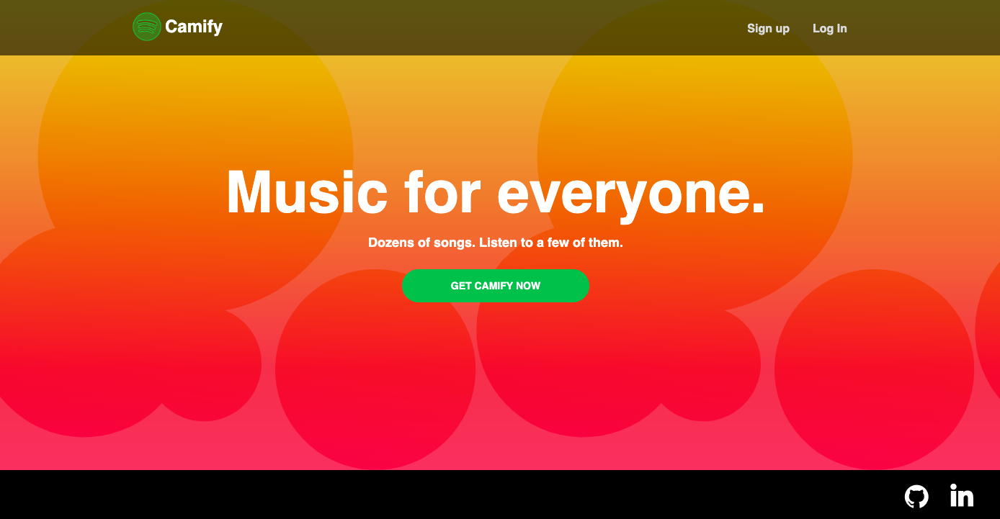

# README

Camify is a full-stack Spotify clone built using Ruby on Rails, React.js, Redux, PostgreSQL, HTML5 & Sass with media hosted on AWS S3.

VIEW LIVE: https://camify-13.herokuapp.com/#/

* Playlist CRUD
* User login and sign up
* Continuous play while navigating through the site

