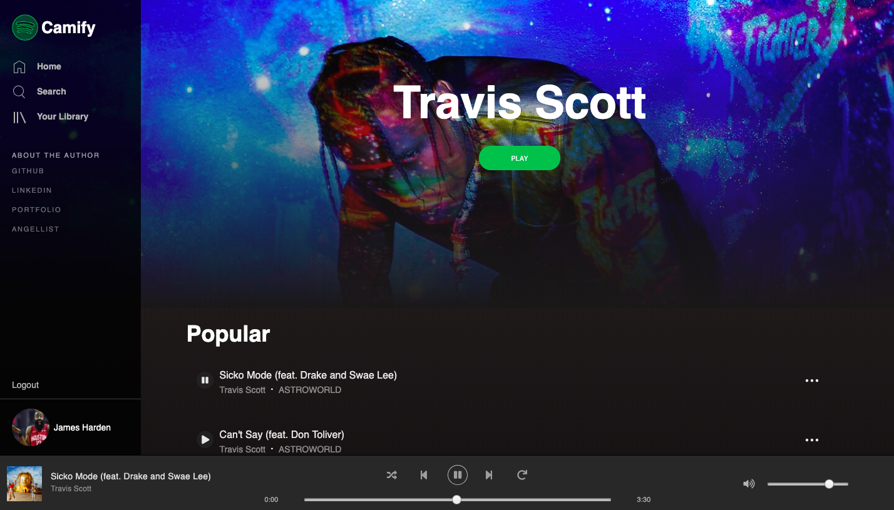

# README

Camify is a full-stack Spotify clone built using Ruby on Rails, React.js, Redux, PostgreSQL, HTML5 & Sass with media hosted on AWS S3.

VIEW LIVE: https://camify-13.herokuapp.com/#/


## Features

* Continuous play while navigating through the site
* Search bar
* Playlist CRUD
* User login and sign up

#### Navigate seamlessly while playing music 

The playbar component's logic is handled in a 'UI' slice of the Redux state. Whenever another React component dispatches an action relevant to the playbar, the action changes the UI slice of state. This allows smooth navigating through the application while music is playing.

```
    export const UIReducer = (state = {}, action) => {
        Object.freeze(state);
        let nextState = merge({}, state);
        switch (action.type) { 
            case PLAY_PAUSE_SONG:
                if (nextState['isPlaying'] && (action.song.id === nextState['currentSong'].id)) {
                    nextState['isPlaying'] = false;
                    return nextState;
                } 
                if (!nextState['isPlaying']) {
                    nextState['currentSong'] = action.song;
                    nextState['isPlaying'] = true;
                } else if (nextState['isPlaying'] === false) {
                    nextState['isPlaying'] = true;
                }
                else if (nextState['currentSong'] != action.song) {
                    nextState['currentSong'] = action.song;
                    nextState['isPlaying'] = true;
                } else if (nextState['isPlaying']) { 
                    nextState['isPlaying'] = false;
                }
                return nextState;
```

The UI Reducer returns a new state when a song playing action is dispatched.



#### Search

Upon navigating to the search component, the application loads all songs, artists, albums, and playlists
to the Redux state. From there, there is an onChange event handler tied to the search bar, with seperate rendering logic for each type of search result.

```
    handleChange (e) {
        const { songs, artists, albums, playlists } = this.props;
        let searchTerm = e.currentTarget.value;
        let foundSongs = [];
        let foundArtists = [];
        let foundAlbums = [];
        let foundPlaylists = [];
        
        songs.forEach(song => {
            if (song.name.toLowerCase().startsWith(searchTerm.toLowerCase())) foundSongs.push(song);
        });
        artists.forEach(artist => {
            if (artist.name.toLowerCase().startsWith(searchTerm.toLowerCase())) foundArtists.push(artist);
        });
        albums.forEach(album => {
            if (album.name.toLowerCase().startsWith(searchTerm.toLowerCase())) foundAlbums.push(album);
        });
        playlists.forEach(playlist => {
            if (playlist.name.toLowerCase().startsWith(searchTerm.toLowerCase())) foundPlaylists.push(playlist);
        })

        let setNothingSearched = false;
        if (searchTerm === "") setNothingSearched = true;
        this.setState({
            nothingSearched: setNothingSearched,
            foundSongs,
            foundArtists,
            foundAlbums,
            foundPlaylists,
        })
        
    }
```

The results are displayed identically to the resource index pages by taking advantage React components' reusability.


#### Create, delete, and add songs to playlists

Modals are used to create, delete, and add songs to playlists.

```
    <div id="library-main">
        <PlaylistModalContainer show={this.state.show} handleClose={this.hidePlaylistModal}>
            <p>Modal</p>
            <p>Data</p>
        </PlaylistModalContainer>
```

There is a piece of component state that is toggled in order to render the modals within their respective outer class components. Clicking on buttons within the modals dispatches actions which persist playlist data to the backend. 


#### User authentication

Users can create a new account, log in with an existing one, or use a demo login. This is done using a Rails authentication pattern that utilizes both a user and session model, and the BCrypt gem to create encrypted password hashes.

## Potential Future Releases

In the future I would like to add:

* The ability for users to save songs to their library
* A genre attribute for songs, and randomly generated featured playlists organized by genre


