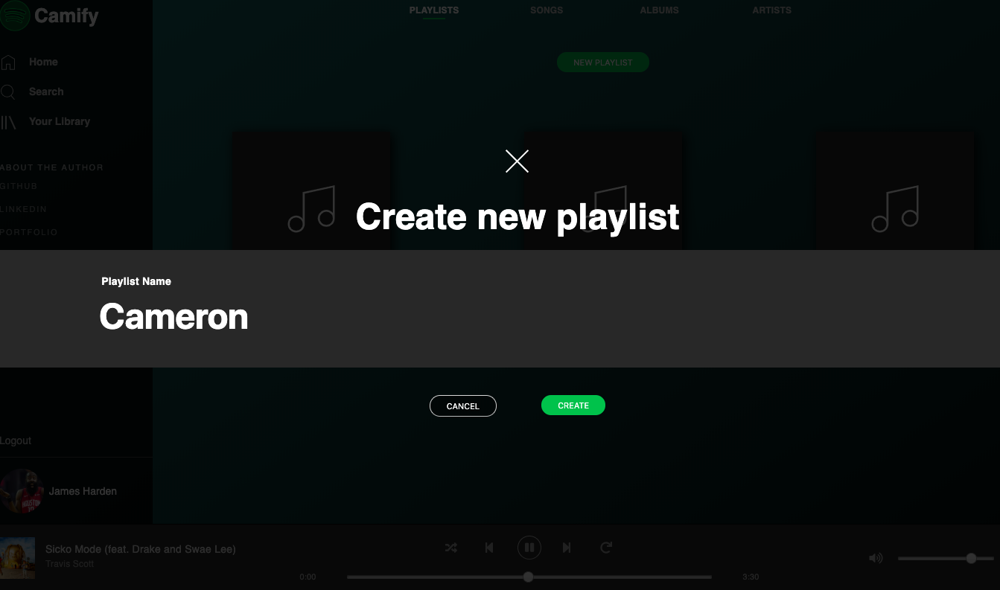

# README

Camify is a full-stack Spotify clone built using Ruby on Rails, React.js, Redux, PostgreSQL, HTML5 & Sass with media hosted on AWS S3.

VIEW LIVE: https://camify-13.herokuapp.com/#/

## Features
* Continuous play while navigating through the site
* Search bar
* Playlist CRUD
* User login and sign up

#### Navigate seamlessly while playing music 

#### Search

#### Create, delete, and add songs to playlists

#### User authentication

